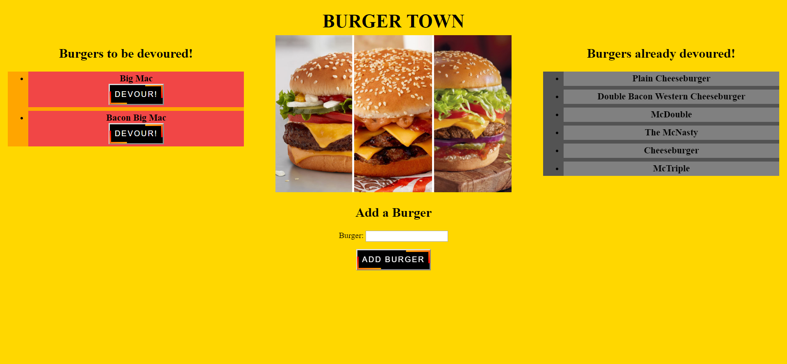

# burger

A simple and straight forward site where you can EAT DA BURGER! Users can add burgers using the form located in the center of the page which will then add them to the list of burgers to be devoured. Upon clicking devour for any burger it is then moved over to the list of burgers devoured. All burgers both devoured and yet to be devoured are persistently tracked using a MySQL database.

# Link to Github
[Burger](https://github.com/JakeDudum/burger)

# Link to Deployed Site (Heroku)
[Burger Town](https://boiling-eyrie-34449.herokuapp.com/)

# Built With
- [HTML](https://developer.mozilla.org/en-US/docs/Learn/HTML)
- [CSS](https://developer.mozilla.org/en-US/docs/Web/CSS)
- [Javascript](https://developer.mozilla.org/en-US/docs/Web/JavaScript)
- [Node](https://nodejs.org/en/about/)
- [NPM](https://docs.npmjs.com/about-npm/)
- [MySQL](https://www.mysql.com/)

# NPM's Used
- [Express](https://www.npmjs.com/package/express)
- [MySQL](https://www.npmjs.com/package/mysql)
- [Express-Handlebars](https://www.npmjs.com/package/express-handlebars)

# Versioning
- [Github](https://github.com/)

# Databases
- [MySQL](https://www.mysql.com/)

# Authors
### Jake Dudum